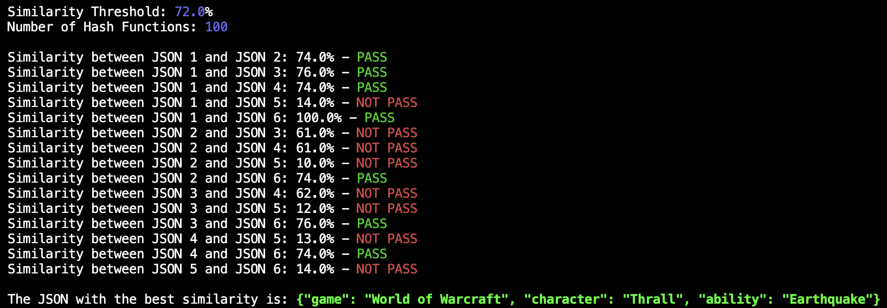

# Rust JSON MinHash Comparator

## Overview

The code compares the similarity of several JSON objects using the MinHash algorithm. It calculates the similarity between pairs of JSON objects and prints the results, indicating whether each pair meets a specified similarity threshold. Additionally, it identifies and returns the JSON object with the highest similarity score above the threshold among all pairs that pass the comparison.

## Step-by-Step Explanation

1. Convert JSON to Set:

Defines a function to convert a JSON object into a set of key-value pairs. This involves flattening nested JSON structures into unique strings.

2. Define Similarity Threshold:

Sets a threshold for how similar the JSON objects need to be to pass the comparison (0.72 in this case).

3. Define JSON Objects:

Lists several JSON strings that will be compared.

4. Parse JSON Strings:

Converts JSON strings into sets of key-value pairs.

5. Create MinHash Instance:

Initializes a MinHash instance with a specified number of hash functions (100).

6. Generate MinHashes:

Creates shingle iterators for each set and computes their MinHash signatures.

7. Calculate and Print Similarities:

- Compares the MinHash signatures of each pair of JSON objects.
- Prints whether each pair meets the similarity threshold, indicating "PASS" or "NOT PASS".

8. Find and Print the Best Similarity:

- Iterates over all pairs of JSON objects to find those that pass the similarity threshold.
- Among those pairs, identifies and returns the JSON object with the highest similarity score.
- Prints the best matching JSON object at the end.

## Summary

The code uses MinHash to estimate the similarity between JSON objects by converting them to sets, generating MinHash signatures, and comparing these signatures. It prints the similarity results for each pair of JSON objects, showing whether they pass the predefined similarity threshold. Additionally, it identifies the JSON object with the highest similarity score among the passing pairs and prints it at the end.

## What's Needed to Run

To run this project, you need to have the following installed:

- [Rust](https://www.rust-lang.org/): Rust programming language and Cargo package manager.
- [Git](https://git-scm.com/): Version control system to clone the repository.

## Dependencies

The project uses the following Rust crates:

- `probabilistic-collections`: Provides MinHash and ShingleIterator for similarity estimation.
- `serde`: Serialization framework to parse JSON.
- `serde_json`: JSON support for Serde.

## How to Run

Follow these steps to run the project:

1. **Build the Project**:
    ```sh
    cargo build
    ```

3. **Run the Project**:
    ```sh
    cargo run
    ```

The program will output the similarity between the given JSON objects.

## Example Output

